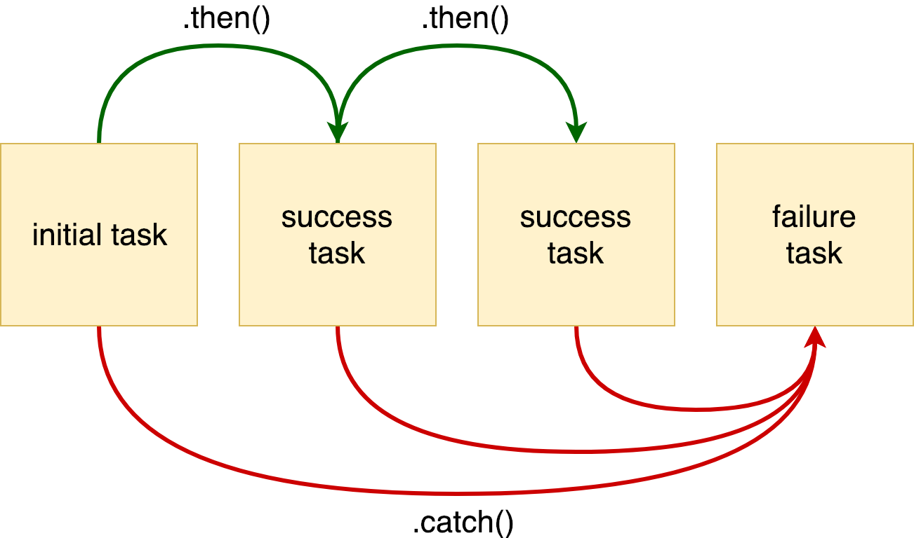

Теория: Обработка ошибок в промисах

Ошибки внутри промисов обрабатываются крайне просто. Для перехвата достаточно вызвать метод catch и передать туда колбек, принимающий на вход саму ошибку:

```ts
import fsp from "fs/promises";

const promise = fsp.readFile("unknownfile");
promise.catch((e) => console.log("error!!!", e));
// => error!!! { [Error: ENOENT: no such file or directory, open 'unknownfile']
// errno: -2, code: 'ENOENT', syscall: 'open', path: 'unknownfile' }
```

catch, в свою очередь, возвращает promise, что позволяет коду восстанавливать работу после ошибок и продолжать цепочку. Вполне нормально писать код в стиле цепочки, в которой чередуются then и catch:

```ts
import fsp from "fs/promises";

const promise = fsp
  .readFile("unknownfile")
  .catch(console.log)
  .then(() => fsp.readFile("anotherUnknownFile"))
  .catch(console.log);
```

В большинстве ситуаций не имеет значения, на какой из операций возникла ошибка. Любое падение должно прерывать текущее выполнение и уходить в блок обработки ошибки. Именно так работает код с try/catch, и такое же поведение эмулируется промисами. Дело в том, что если возникла ошибка, то она передается по цепочке первому встреченному catch, а все встречающиеся на пути then игнорируются. Поэтому код выше можно упростить так:

```ts
import fsp from "fs/promises";

const promise = fsp
  .readFile("unknownfile")
  .then(() => fsp.readFile("anotherUnknownFile"))
  .catch(console.log);
```

Семантически эти версии кода не эквивалентны. В первом случае вторая операция чтения начнет выполняться обязательно, независимо от того, как закончилась предыдущая. В последнем — если упадет первое чтение файла, то второе не будет выполнено.



Иногда ошибку нужно генерировать самостоятельно. Самый простой способ сделать это — бросить исключение. К этому тоже надо привыкнуть. try/catch использовать нельзя, так как он работает с синхронным кодом, а вот бросать исключения можно. Промис сам их преобразует, как надо, и отправит по цепочке в поиске вызова catch:

```ts
import fsp from "fs/promises";

// Файл unknownfile существует, но нам все равно нужно выкинуть ошибку
const promise = fsp
  .readFile("unknownfile")
  .then((data) => {
    // делаем что-нибудь
    throw new Error("boom!");
  })
  .then(() => {
    // Этот then не будет вызван из—за исключения на предыдущем шаге
  })
  .catch(console.log);
```

Другой способ — вернуть результат вызова функции Promise.reject, внутрь которой передается сама ошибка:

```ts
import fsp from "fs/promises";

const promise = fsp
  .readFile("unknownfile")
  .then((data) => {
    // делаем что-нибудь
    return Promise.reject(new Error("boom!"));
  })
  .catch(console.log);
```

Помимо чисто технических моментов в обработке ошибок есть и архитектурно-организационные. Если вам приходится реализовывать асинхронные функции, которыми будут пользоваться другие люди, то никогда не подавляйте ошибки:

```ts
import fsp from "fs/promises";
// Подавление ошибки при помощи catch()
const readFileEasily = (filepath) => fsp.readFile(filepath).catch(console.log);
```

Перехватив ошибку, вы не оставляете шансов узнать о ней вызывающему коду. Тот, кто использует эту функцию, не сможет отреагировать на ошибочную ситуацию. Если обработка ошибки все же нужна — обрабатывайте, но не забывайте генерировать ее снова:

```ts
import fsp from "fs/promises";
// Перехватывая ошибку при помощи catch(), мы не даем ей попасть в вызывающий код
// Это нежелательное поведение — в конце ошибку нужно выбросить снова
const readFileEasily = (filepath) =>
  fsp.readFile(filepath).catch((e) => {
    console.log(e); // В библиотеках так делать нельзя, только в своем коде
    throw e;
  });

// Теперь вызывающий код может обработать ошибку:

readFileEasily("path/to/file").catch(/* ... */);
```
