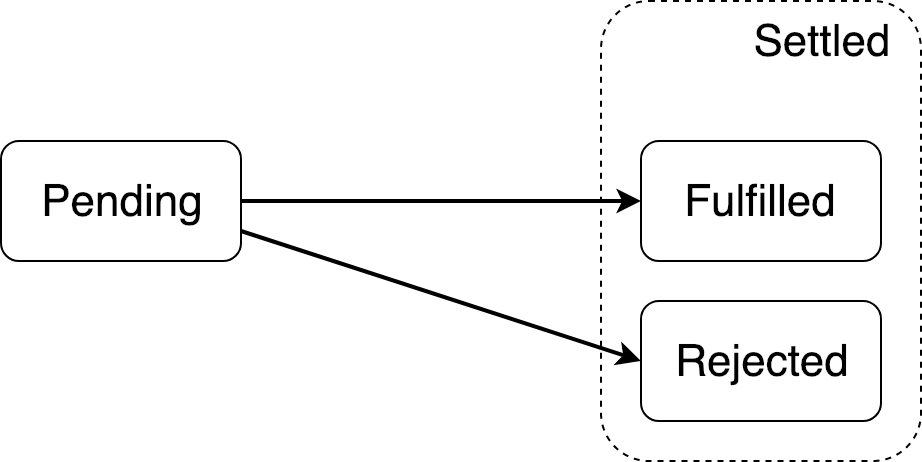

Теория: new Promise

Если в проекте появились промисы, то, по-хорошему, весь код должен работать только через них. К сожалению, далеко не все библиотеки имеют интерфейс с промисами и работают по старинке, на колбеках. В таких случаях функции нужно "обернуть" или, как говорят, "промисифицировать". Создание промиса происходит с помощью конструктора Promise:

```ts
import fs from "fs";

const promise = new Promise((resolve, reject) => {
  fs.readFile("/etc/passwd", (err, data) => {
    if (err) {
      reject(err);
      return;
    }
    resolve(data);
  });
});
```

Промис ожидает на вход функцию, которая будет вызвана в момент его создания. Именно внутри этой функции и нужно выполнять асинхронную операцию (на колбеках), которую мы хотим превратить в промис. Промис прокидывает в эту функцию два колбека:

resolve — должна быть вызвана в случае успешного завершения асинхронной операции. Ей на вход отдаётся результат этой операции.
reject — должна быть вызвана в случае ошибки. На вход, соответственно, отдаётся ошибка.
Эти функции принимают на вход ровно один аргумент, который затем передаётся либо в then (как данные), либо в catch (как ошибка). Причём достаточно, чтобы вызывалась хотя бы одна из этих функций. Вполне возможно, что понадобится создать промис, который всегда завершается успешно — и это легко сделать, никогда не вызывая reject.

В конечном итоге конструкция new Promise() возвращает самый настоящий промис, с которым можно работать уже привычным для нас способом:

```ts
promise.then(console.log).catch(console.log);
```

А что, если нужно обернуть две асинхронных операции или три, или даже больше? Придётся оборачивать каждую из них независимо. Другими словами, одна асинхронная операция — один конструктор new Promise. Кстати, эту задачу можно автоматизировать, и в ноду встроена специальная функция, которая делает промисы из асинхронных функций:

```ts
import util from "util";
import fs from "fs";

const stat = util.promisify(fs.stat);
stat(".")
  .then((stats) => {
    // Do something with `stats`
  })
  .catch((error) => {
    // Handle the error.
  });
```

Во фронтенде такое тоже возможно, достаточно "загуглить" пакет, предоставляющий функцию promisify.

В реальной жизни встречаются задачи, когда асинхронного кода нет, но нужен промис, чтобы построить цепочку. Такой промис можно создать самостоятельно:

```ts
const promise = new Promise((resolve) => resolve());
// promise.then ...
```

То же самое для промиса, который завершается неуспешно:

```ts
const promise = new Promise((resolve, reject) => reject());
```

Для этих задач добавили специальные сокращения, с которыми код становится чище:

```ts
const promise1 = Promise.resolve();
// promise1.then ...

const promise2 = Promise.reject();
// promise2.catch ...
```

Устройство



С технической точки зрения, промис — это объект, имеющий три состояния (см. конечные автоматы и автоматное программирование): pending, fulfilled и rejected. Промис начинается в состоянии pending, а затем, с помощью функций ("событий", как говорят в теории автоматов) resolve и reject переводится в одно из конечных (терминальных) состояний fulfilled или rejected. Перейдя однажды в эти состояния, промис уже не может откатиться назад или уйти в другое терминальное состояние. То есть после вызова resolve, нет способа привести промис в состояние rejected, вызывая функцию reject.
