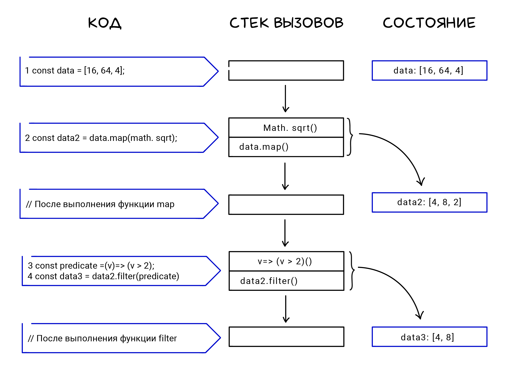
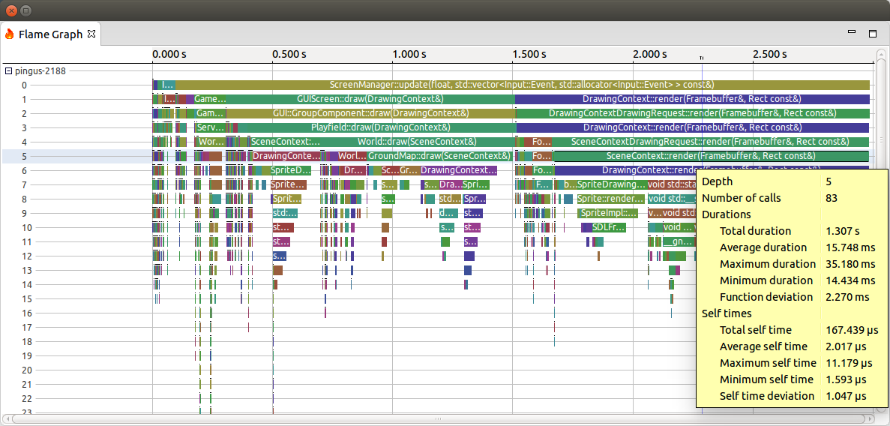

# Теория: Стек вызовов (Call Stack)

Перед тем, как погружаться в асинхронное программирование, разберём один важный момент, связанный с исполнением кода. Посмотрите на пример:

---

```ts
const data = [16, 64, 4];
const data2 = data.map(Math.sqrt); // [4, 8, 2]
const predicate = (v) => v > 2;
const data3 = data2.filter(predicate); // [4, 8]
```

Каждая строчка в коде выше выполняется только тогда, когда выполнится предыдущая. В программировании, такое последовательное исполнение кода (инструкций) называют **синхронным**. Причём выполнение каждой конкретной строчки может быть сколь угодно сложным.

Если посмотреть на вторую строку, то видно, что вызывается метод map(), который внутри себя вызывает функцию Math.sqrt(). В реальных приложениях глубина проваливания внутрь функций может быть просто огромной, на сотни уровней. Во время выполнения кода, такое проваливание создает **стек вызовов (call stack)**. Почему именно стек? Потому что так происходит процесс исполнения кода. Каждый внутренний вызов добавляет текущую функцию внутрь стека — и так до самой глубокой функции. Затем, когда происходит возврат, начинается раскрутка стека — из него по очереди (в обратном порядке) извлекаются функции и продолжают своё выполнение с того места, где внутренняя функция вернула результат.



Предположим, что у нас есть цепочка функций one() вызывает two() вызывает three(), который вызывает four():

```ts
const four = () => console.log("END!");
const three = () => four();
const two = () => three();
const one = () => two();

one(); // Запускаем
```

Тогда процесс исполнения кода будет выглядеть так:

`one => two => three => four => three => two one`
То есть сначала идет погружение до самого вложенного вызова, затем подъем до первой функции в стеке вызовов.

Мы, как разработчики, видим стек вызовов каждый день в выводе ошибок. Backtrace (обратная трассировка) — не что иное, как стек вызовов, записанный в обратном порядке. Для демонстрации допустим ошибку в третьей строке нашего кода:

```ts
const data = [16, 64, 4];
const data2 = data.map(Math.sqrt); // [4, 8, 2]
const predicate = (v) => unknown > 2;
const data3 = data2.filter(predicate); // ReferenceError
```

Запуск (код расположен в файле index.js) и вывод:

```
node index.js

index.js:3
const predicate = (v) => unknown > 2;
                               ^

ReferenceError: unknown is not defined
    at predicate (index.js:3:32)
    at Array.filter (<anonymous>)
    at Object.<anonymous> (index.js:4:21)
```

Важно понимать, что стек вызовов растёт только тогда, когда вызовы идут в глубину. Это видно по выводу: в бектрейсе не фигурирует первая и вторая строчки, в нём описана последовательность, начиная от вызова фильтра и дальше.

Механизм исключений в js, как и в других языках, полностью опирается на наличие стека вызовов. Более того, он создан, чтобы было удобно «раскручивать» этот стек. Любое возникающее исключение поднимается вверх по стеку вызовов, до тех пор пока не наткнется на конструкцию try/catch либо до тех пор, пока стек вызовов не закончится.

```ts
const data = [16, 64, 4];
const data2 = data.map(Math.sqrt); // [4, 8, 2]
const predicate = (v) => unknown > 2;

try {
  const data3 = data2.filter(predicate); // ReferenceError
} catch (e) {
  console.log("Catch it");
  console.log(e.stack);
}
```

И хотя объявление функции predicate(), содержащей ошибку, находится вне блока try/catch, он всё равно поймает ошибку внутри этой функции, так как predicate() вызывается внутри по цепочке.

```
node index.js

Catch it
ReferenceError: unknown is not defined
    at predicate (index.js:3:32)
    at Array.filter (<anonymous>)
```

Существуют специальные инструменты, которые позволяют визуализировать стек вызовов. Обычно их используют во время профайлинга — процесса поиска узких мест для ускорения приложения.


Но всё меняется, когда речь идёт об асинхронном коде. Подробнее в следующем уроке.

Доп.Материалы
https://habr.com/ru/companies/hexlet/articles/656003/
