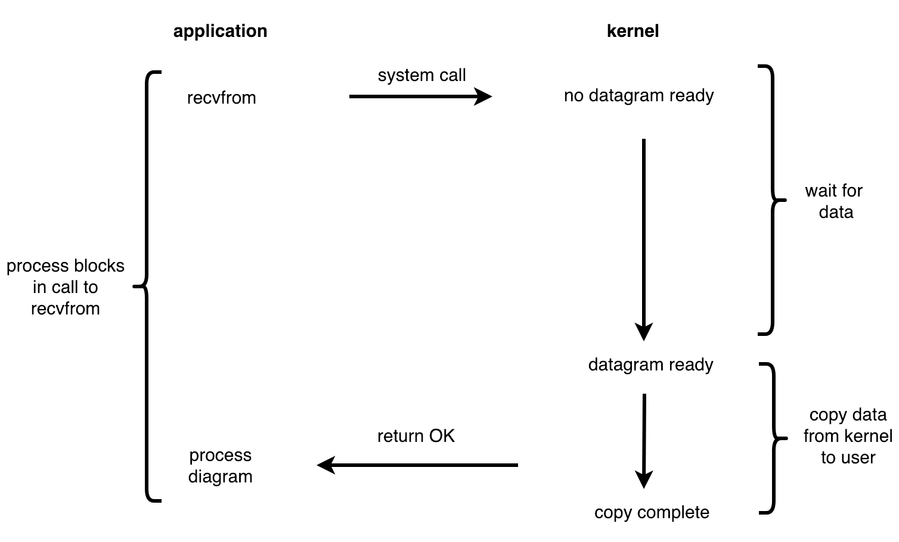

Теория: Асинхронный код

Примеры в этом уроке даются на основе работы с файловой системой, потому что именно они лучше всего раскрывают суть асинхронного программирования. Принципы работы асинхронного кода абсолютно идентичны и для фронтенда, и для бекенда.

В синхронном коде выполнение функций происходит в том же месте, где они были вызваны, и в тот момент, когда происходит вызов. В асинхронном коде всё по-другому. Вызов функции не означает, что она отработает прямо здесь и сейчас. Более того, мы не знаем, когда она отработает. Разберём пример с копированием файла через чтение и повторную запись в другой файл:

```ts
import fs from "fs";

// Обязательно передавать вторым параметром `utf-8`,
// только тогда данные возвратятся в строковом представлении
const content = fs.readFileSync("./myfile", "utf-8");
fs.writeFileSync("./myfile-copy", content);
```

Пример кода написан для Node.js: здесь используется модуль fs и его синхронные функции для чтения и записи файла (их особенность в том, что имена оканчиваются на Sync). Такой код работает как ожидается: сначала читается содержимое файла в константу content, затем оно же записывается в другой файл. Каждая строчка приводит к блокировке, то есть выполнение программы ждёт, пока операционная система прочитает файл (а это делает именно она) и отдаст его содержимое программе, и только затем выполняется следующая строчка. Соответственно, там, где происходит запись, программа ожидает, пока операционная система запишет файл на диск (это не совсем правда, но данная тема выходит за рамки урока, подробнее в книгах по операционным системам), и только затем продолжает работу.



В принципе, здесь можно было бы и остановиться — зачем что-то делать с этим кодом? Дело в том, что любые файловые операции занимают много времени (они в тысячи раз медленнее, чем вызов обычной функции). В течение этого времени процесс ожидает ответ от ядра о результате операции, не делая ничего другого. Поэтому синхронный подход в случае файловых операций очень неэффективно использует ресурсы. Асинхронный же код продолжает выполняться во время любых файловых операций. Другими словами, код никогда не блокируется на IO операциях, но может узнать об их завершении. Правильно написанные асинхронные программы (в тех ситуациях, где это нужно) значительно эффективнее синхронных. Иногда это настолько критично, что синхронная версия просто не справится с задачей.

Небольшая ремарка. IO (Input/Output) — это ввод/вывод. К нему относится не только работа с файлами, но и любое сетевое взаимодействие (которое, в конечном итоге, сводится к работе с файлами). Даже печать на экран — это тоже запись в файл.

Теперь попробуем прийти к асинхронному коду через понимание принципов его работы. Представим, что функция readFile в примере ниже асинхронная. Это значит, что она читает файл не прямо в том месте, где её вызвали, а где-то в другом месте в фоновом режиме:

```ts
import fs from "fs";

// пустая функция, чуть позже разберём её смысл,
// но асинхронная версия readFile требует передачи функции третьим параметром
const noop = () => {};
const content = fs.readFile("./myfile", "utf-8", noop);
console.log(content);
```

Возможно ли появление такого асинхронного кода? Ответ сразу — нет. Неважно, какую конкретно задачу выполняет эта функция, важно лишь одно — она не выполняет её сразу, а значит у неё невозможен возврат результата выполнения асинхронной операции. Если запустить подобный код, то мы увидим такой вывод:

```
node index.js
undefined
```

Это фундаментальная особенность асинхронных функций, которую нужно запомнить раз и навсегда. Приходится подчёркивать этот момент, потому что новички постоянно спотыкаются на нём, пытаясь работать с асинхронными функциями как с синхронными.

Тогда возникает вопрос: как получить результат выполнения этой функции? А вот для этого используется еще одна функция, которая передаётся в асинхронную. В этом качестве она называется функцией обратного вызова или просто колбек (callback). Эта функция будет вызвана в тот момент, когда операция закончится (возможно, с ошибкой). Она имеет следующую сигнатуру: callback(error, result). Первым параметром в неё передаётся ошибка, если всё было плохо, вторым — результат операции, если всё было хорошо. Про ошибки мы поговорим чуть позже, а сейчас разберём общие принципы работы.

```ts
import fs from "fs";

// Вызовется тогда, когда выполнится асинхронная операция
const callback = (_error, data) => console.log(data);
// префиксом нижнего подчёркивания обозначается неиспользуемый аргумент

// readFile запускает на выполнение задачу чтения файла.
// Вторым параметром обязательно передать utf-8.
// Только в этом случае данные прочитаются в строковом виде.
fs.readFile("./myfile", "utf-8", callback);
```

Запуск и вывод:

```
node index.js
content of file
```

Как только операция чтения файла завершилась, интерпретатор Node.js внутри себя вызвал колбек, передав ему параметром содержимое файла. Осталось убедиться в том, что этот код действительно асинхронный:

```ts
import fs from "fs";

const callback = (_error, data) => console.log(data);
console.log("before read");
// вызов функции не дожидается конца чтения файла,
// код сразу продолжит выполняться дальше
fs.readFile("./myfile", "utf-8", callback);
console.log("after read?");
```

Запуск и вывод:

```
node index.js
before read
after read?
content of file
```

Несмотря на то, что after read? выводится последней инструкцией, реальный вывод отличается от порядка инструкций в коде. Асинхронная функция хоть и запустилась на выполнение сразу, но колбек вызывается только в тот момент, когда в текущем стеке вызовов не останется ни одной функции. В нашем случае это означает, что колбек запускается только после того, как отработает весь файл. И этот запуск породит свой собственный стек вызовов.

В асинхронном коде каждый колбек асинхронной функции порождает свой собственный стек вызовов, который, в свою очередь, может выполнять новые асинхронные вызовы и так далее до бесконечности.

Node.js дожидается завершения всех асинхронных вызовов, которые были сделаны в процессе работы программы:

```ts
import fs from "fs";

fs.readFile("./myfile", "utf-8", (_error, data) => console.log("First!"));
fs.readFile("./myfile", "utf-8", (_error, data) => console.log("Second!"));
```

В примере выше мы видим запуск двух асинхронных операций. Теперь мы знаем, что второе чтение файла запустится практически одновременно с первым, так как операции асинхронные и их выполнение не блокирует поток выполнения программы. Попробуйте ответить на вопрос, в каком порядке появится результат?

Запуск и вывод:

```
node index.js

Second!
First!

node index.js

First!
Second!
```

Как видите, на этот вопрос нельзя дать однозначный ответ. Асинхронные операции могут выполниться в любом порядке, если они запускаются одновременно. И единственный способ упорядочить их — делать последовательный запуск, и об этом мы поговорим далее.

Асинхронное программирование значительно сложнее синхронного. Видеть линейный код (последовательно записанный) и думать о нём нелинейно — очень тяжело. Дальше вы увидите, что с ростом числа асинхронных функций в рамках одной программы сложность увеличивается экспоненциально, и в какой-то момент перестаёшь понимать, что происходит. Для борьбы с ней придумано множество выходов, некоторые из которых оказались очень удачными и рассматриваются в более поздних уроках курса.
